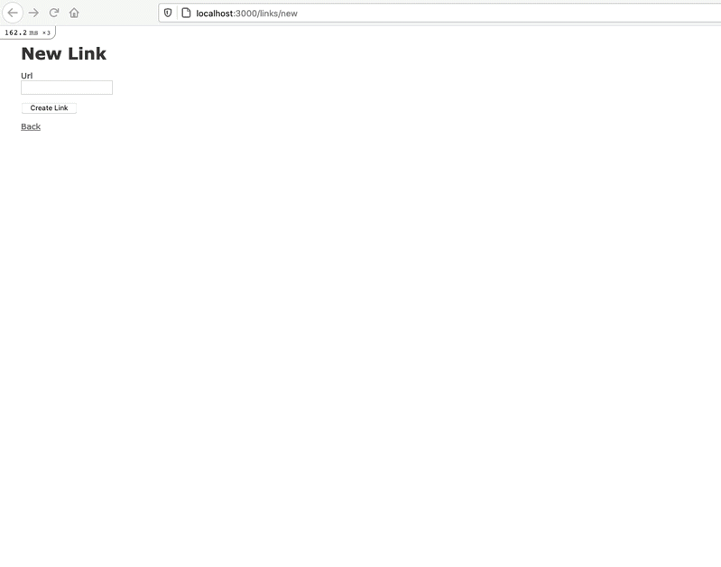
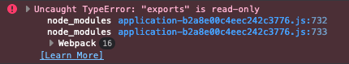
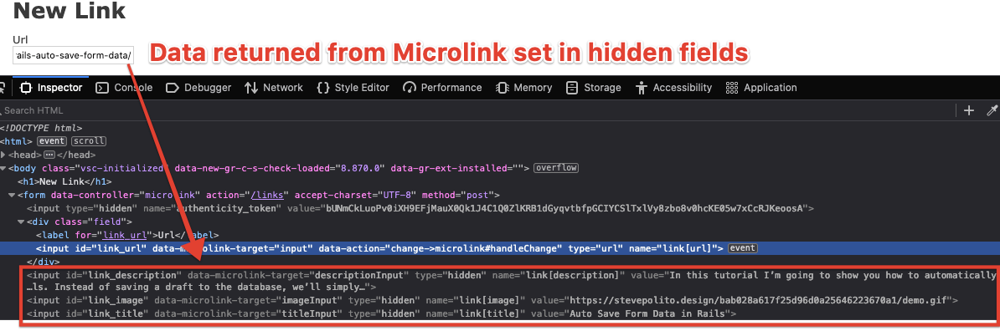
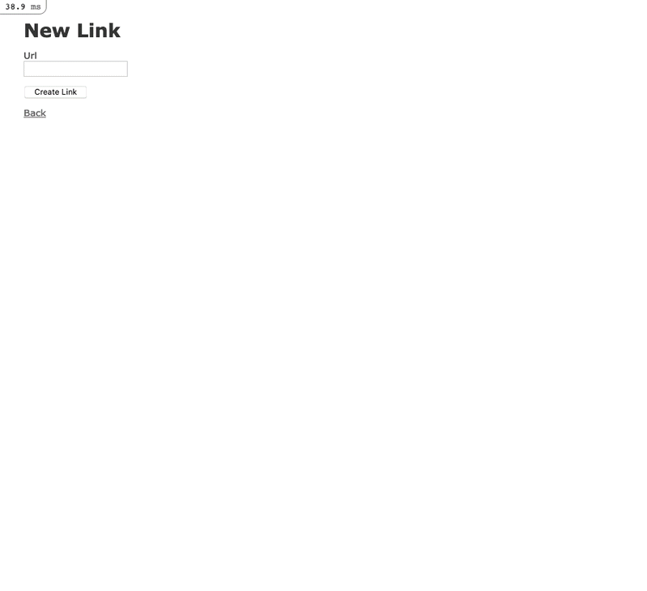
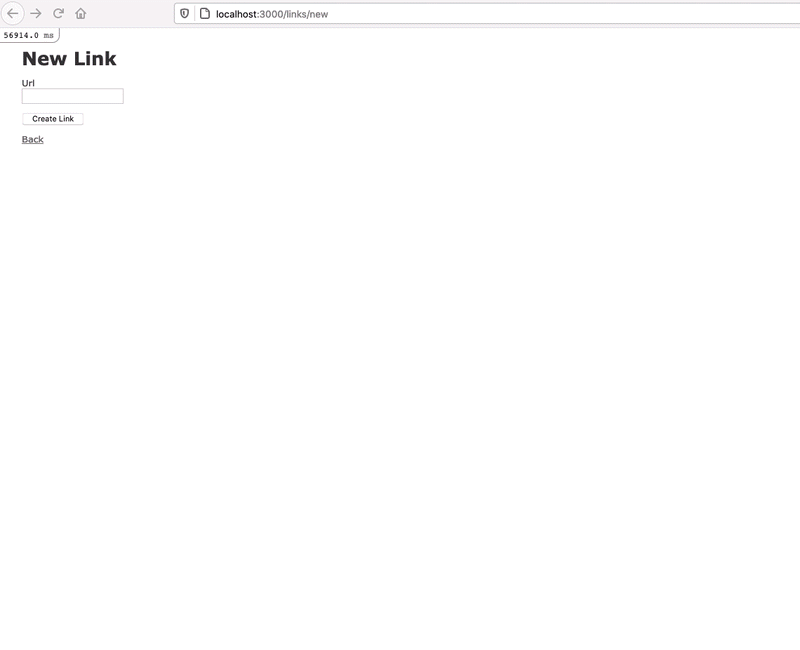

# Create link previews in Rails with Microlink 



## Step 1: Application Set Up

1. `rails new rails-microlink-example -d=postgresql --webpacker=stimulus`
2. `rails db:create`
3. `rails db:migrate`

## Step 2: Create Link Scaffold

1. `rails g scaffold link url:string`
2. Prevent null values at the database level.

```ruby{4}
class CreateLinks < ActiveRecord::Migration[6.1]
  def change
    create_table :links do |t|
      t.string :url, null: false

      t.timestamps
    end
  end
end
```

3. `rails db:migrate`
4. Add validations.

```ruby{2}
class Link < ApplicationRecord
    validates :url, presence: true
end
```

## Step 3. Add meta_data column to links table

1. `rails add_meta_data_to_link meta_data:jsonb`
2. `rails db:migrate`
3. Use [ActiveRecord::Store](https://api.rubyonrails.org/classes/ActiveRecord/Store.html) to serialize data saved to the `meta_data` column. We can call these accessors anything we want to, but we'll use the sames names that at returned from the [Microlink response](https://microlink.io/docs/api/getting-started/overview)

```ruby{2}
class Link < ApplicationRecord
    store :meta_data, accessors: [ :description, :image, :title  ], coder: JSON
    validates :url, presence: true
end
```

> We could create a separate column for each `accessor`, but using `ActiveRecord::Store` allows for greater flexibly and keeps the database simple.

4. Update `link_params` to include values from the `meta_data` column.

```ruby{6}
class LinksController < ApplicationController
 ...
 private
    ...
    def link_params
      params.require(:link).permit(:url, :description, :image, :title)
    end
end
```

## Step 4: Install and configure Microlink

1. `yarn add @microlink/mql`
2. `touch app/javascript/controllers/microlink_controller.js`

```javascript
import { Controller } from "stimulus"
import mql from "@microlink/mql"

export default class extends Controller {
}
```

> If you were you run `rails s` and view the console, you would see the following error:



3. Update `babel.config.js` by adding `sourceType: "unambiguous"`.

```javascript{4}
module.exports = function(api) {
  ...  
  return {
    sourceType: "unambiguous",
    presets: [
        ...
    ].filter(Boolean),
    ...
  }
}
```

> I found this solution be searching for the error and came across these resources: 
> - https://github.com/webpack/webpack/issues/4039
> - https://babeljs.io/docs/en/options#sourcetype

## Step 5: Save API Response to Hidden Fields

1. Update the markup in `app/views/links/_form.html.erb`.

```erb{1,5,8-10}
<%= form_with(model: link, data: { controller: "microlink" }) do |form| %>
  ...
  <div class="field">
    <%= form.label :url %>
    <%= form.url_field :url, data: { microlink_target: "input", action: "change->microlink#handleChange" } %>
  </div>

  <%= form.hidden_field :description, data: { microlink_target: "descriptionInput" } %>
  <%= form.hidden_field :image, data: { microlink_target: "imageInput" } %>
  <%= form.hidden_field :title, data: { microlink_target: "titleInput" } %>
  ...
<% end %>
```

2. Build `handleChange` method in `app/javascript/controllers/microlink_controller.js`.

```javascript{5-18}
import { Controller } from "stimulus"
import mql from "@microlink/mql"

export default class extends Controller {
    static targets = [ "input", "descriptionInput", "imageInput", "titleInput" ]

    async handleChange() {
        const { status, data } = await mql(this.inputTarget.value)
        if(status == "success") {
            this.setFormData(data);
        }
    }

    setFormData(data) {
        this.descriptionInputTarget.value   = data?.description ? data?.description : null;
        this.imageInputTarget.value         = data?.image?.url ? data?.image?.url : null;
        this.titleInputTarget.value         = data?.title ? data?.title : null;
    }
}
```

> Now when a user enters a URL, the hidden fields will be set with the response from the Microlink API.



## Step 6: Render Link Preview

1. Create a `app/views/links/_preview.html.erb ` partial.

```erb
<div data-microlink-target="output" style="<%= @link.persisted? ? nil : 'display: none;' %>">
    "/>
    <div>
        <h5><%= @link.persisted? ? @link.title : nil %></h5>
        <p><%= @link.persisted? ? @link.description : nil %></p>
    </div>
</div>
```

2. Add the partial to `app/views/links/_form.html.erb`.

```erb{3}
<%= form_with(model: link, data: { controller: "microlink" }) do |form| %>
  ...
  <%= render "preview" %>  
<% end %>
```

3. Add the partial to `app/views/links/show.html.erb `.

```erb{8-10}
<p id="notice"><%= notice %></p>

<p>
  <strong>Url:</strong>
  <%= @link.url %>
</p>

<%= link_to @link.url, target: "_blank" do %>
  <%= render "preview" %>
<% end %>

<%= link_to 'Edit', edit_link_path(@link) %> |
<%= link_to 'Back', links_path %>
```

4. Build the `renderPreview` method in `app/javascript/controllers/microlink_controller.js`.

```javascript{1,7-11,17,21-26}
import { Controller } from "stimulus"
import mql from "@microlink/mql"

export default class extends Controller {
    static targets = [ "input", "descriptionInput", "imageInput", "titleInput", "output" ]

    connect() {
        this.previewDescription = this.outputTarget.querySelector("p");
        this.previewImage       = this.outputTarget.querySelector("img");
        this.previewTitle       = this.outputTarget.querySelector("h5");
    }

    async handleChange() {
        const { status, data } = await mql(this.inputTarget.value)
        if(status == "success") {
            this.setFormData(data);
            this.renderPreview(data);
        }
    }

    renderPreview(data) {
        this.previewDescription.innerHTML = data?.description ? data.description : null;
        data?.image?.url ? this.previewImage.setAttribute("src", data.image.url) : null;
        this.previewTitle.innerHTML = data?.title ? data.title : null;
        this.outputTarget.style.display = "block";
    }

    setFormData(data) {
        this.descriptionInputTarget.value   = data?.description ? data.description : null;
        this.imageInputTarget.value         = data?.image?.url ? data.image.url : null;
        this.titleInputTarget.value         = data?.title ? data.title : null;
    }
}
```

> At this point you should be able to render a link preview.

.

## Step 7: Attaching the Preview Image to the Link

Right now we're not actually attaching the image to the `Link` but rather we're saving the absolute URL to the image. This means that over time those images could break, since we have no control over them. One solution is to download the image and attach it to the `Link` using [Active Storage](https://guides.rubyonrails.org/active_storage_overview.html).

1. Run `rails active_storage:install` and `rails db:migrate` to install **Active Storage**.
2. Add `has_one_attached :thumbnail` to Link Model.

```ruby{4}
class Link < ApplicationRecord
    store :meta_data, accessors: [ :description, :image, :title  ], coder: JSON
    validates :url, presence: true
    has_one_attached :thumbnail
end
```

3. Run `bundle add down` to install the [down gem](https://github.com/janko/down). This will make downloading the remote image returned from the Microlink API easier than by doing it with native Ruby.
4. Run `rails g job microlink_image_attacher` to generate an [Active Job](https://guides.rubyonrails.org/active_job_basics.html). We'll use this Job to download and attach the image returned from the Microlink API.

```ruby
require "down"

class MicrolinkImageAttacherJob < ApplicationJob
  queue_as :default
  discard_on Down::InvalidUrl

  def perform(link)
    if link.image.present?
      tempfile = Down.download(link.image)
      link.thumbnail.attach(io: tempfile, filename: tempfile.original_filename) 
    end
  end
end
```

> We add `discard_on Down::InvalidUrl` to [discard any job](https://guides.rubyonrails.org/active_job_basics.html#retrying-or-discarding-failed-jobs) that returns a `Down::InvalidUrl` exception. This can happen is the Microlink API returns a base64 image.

5. Perform MicrolinkImageAttacherJob when a Link is saved.

```ruby
class LinksController < ApplicationController
  ...
  def create
    @link = Link.new(link_params)

    respond_to do |format|
      if @link.save
        MicrolinkImageAttacherJob.perform_now(@link)
        ...
      else
        ...
      end
    end
  end

end
```

> You could call `perform_later` instead of `perform_now`.

6. Render attached thumbnail in `app/views/links/_preview.html.erb`.

```erb{2}
<div data-microlink-target="output" style="<%= @link.persisted? ? nil : 'display: none;' %>">
    "/>
    <div>
        <h5><%= @link.persisted? ? @link.title : nil %></h5>
        <p><%= @link.persisted? ? @link.description : nil %></p>
    </div>
</div> 
```

Now when you save a link that returns an image, it will be saved in **Active Storage**.

## Step 8: Handling Errors and Improving the UX

Now that we have our happy path complete, we should improve the UX to account for any errors. Most notably, when someone enters an invalid URL or if the Microlink API returns an error.

1. Add markup for rendering a message to `app/views/links/_form.html.erb `.

```erb{6}
<%= form_with(model: link, data: { controller: "microlink" }) do |form| %>
  ...
  <div class="field">
    <%= form.label :url %>
    <%= form.url_field :url, data: { microlink_target: "input", action: "change->microlink#handleChange" } %>
    <span data-microlink-target="message"></span>
  </div>
  ...
  <%= render "preview" %>
<% end %>
```

2. Update `app/javascript/controllers/microlink_controller.js` to handle errors and render messages.

```javascript{5,13-22,34-38,40-45}
import { Controller } from "stimulus"
import mql from "@microlink/mql"

export default class extends Controller {
    static targets = [ "input", "descriptionInput", "imageInput", "titleInput", "output", "message" ]

    connect() {
        this.previewDescription = this.outputTarget.querySelector("p");
        this.previewImage       = this.outputTarget.querySelector("img");
        this.previewTitle       = this.outputTarget.querySelector("h5");
    }

    async handleChange() {
        this.messageTarget.innerText = null;
        this.clearFormData();
        this.clearPreview();
        if (this.inputTarget.value != "") {
            try {
                const { status, data } = await mql(this.inputTarget.value)
                this.messageTarget.innerText = "Fetching link preview...";
                if(status == "success") {
                    this.setFormData(data);
                    this.renderPreview(data);
                    this.messageTarget.innerText = null;
                } else {
                    this.messageTarget.innerText = "There was an error fetching the link preview.";
                }
            } catch(e) {
                this.messageTarget.innerText = e;
            }
        }
    }

    clearFormData() {
        this.descriptionInputTarget.value   = null;
        this.imageInputTarget.value         = null;
        this.titleInputTarget.value         = null;
    }

    clearPreview() {
        this.previewDescription.innerHTML   = null;
        this.previewImage.setAttribute("src", "");
        this.previewTitle.innerHTML         = null;
        this.outputTarget.style.display     = "none";
    }

    renderPreview(data) {
        this.previewDescription.innerHTML = data?.description ? data.description : null;
        data?.image?.url ? this.previewImage.setAttribute("src", data.image.url) : null;
        this.previewTitle.innerHTML = data?.title ? data.title : null;
        this.outputTarget.style.display = "block";
    }

    setFormData(data) {
        this.descriptionInputTarget.value   = data?.description ? data.description : null;
        this.imageInputTarget.value         = data?.image?.url ? data.image.url : null;
        this.titleInputTarget.value         = data?.title ? data.title : null;
    }
}
```

